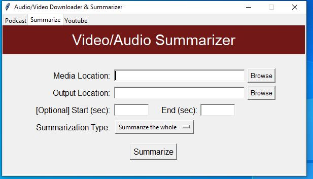
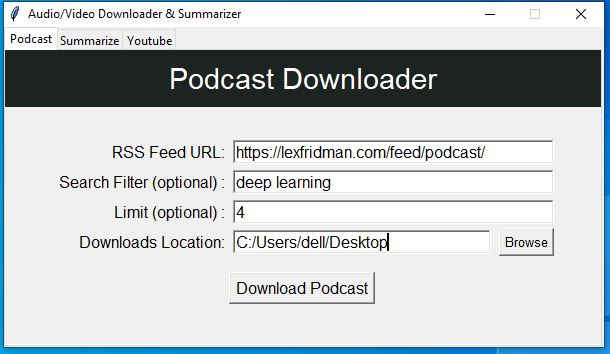

# Media Downloader and Summarizer
This GUI program provides following features:

## Youtube Downloader
Download youtube videos of any avialable quality at high speed. Also download only mp3 audio.

## Video/Audio Summarizer
Summarize the whole video/audio or create the automatically generated summarized chapters from it. 

It requires ASSEMBLY AI API key that can be acquired for free at [AssemblyAI](https://www.assemblyai.com/)

## Podcast Downloader
Download the filtered episodes from your favorite podcasts instantly.

**How to get RSS Feed URL?**

Go to your favorite podcast at [Google Podcasts](https://podcasts.google.com/). Copy the url and paste it at [GetRSSFeed](https://getrssfeed.com/) to get RSS Feed URL.
